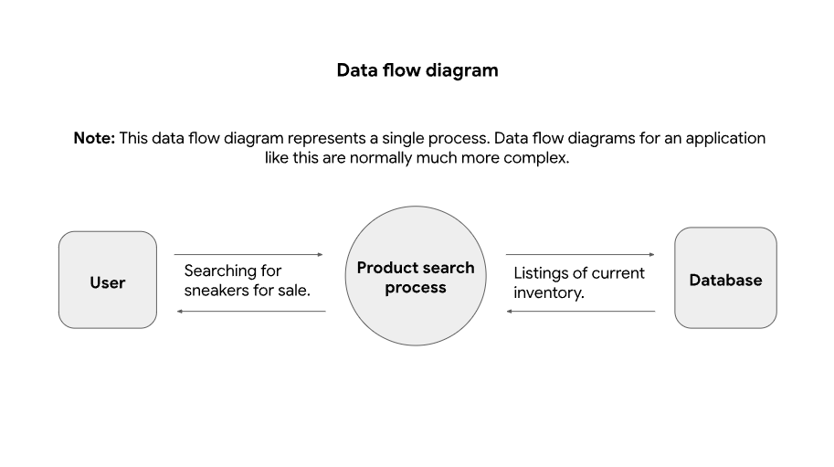
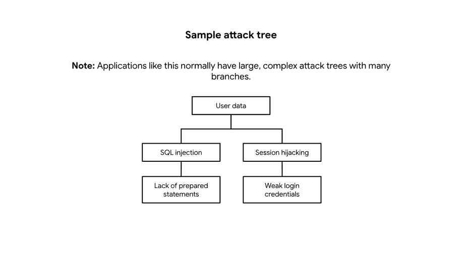

# PASTA Threat Model Analysis

## Overview

This project applies the Process for Attack Simulation and Threat Analysis (PASTA) framework to evaluate security risks in a mobile sneaker marketplace application.

The analysis focuses on identifying business objectives, evaluating technologies, analyzing threats and vulnerabilities, modeling attack paths, and recommending security controls to reduce the likelihood of data breaches and application compromise.

---

## Scenario

A sneaker marketplace company is preparing to launch a mobile application that allows buyers and sellers to exchange products, communicate, and process payments online.

The application handles sensitive customer data, payment information, authentication systems, and database transactions. A threat model was conducted using the seven stages of the PASTA framework to identify potential attack vectors and improve security requirements before deployment.

---

## PASTA Framework Stages

1. Define Business and Security Objectives
2. Define Technical Scope
3. Application Decomposition
4. Threat Analysis
5. Vulnerability Analysis
6. Attack Modeling
7. Risk and Impact Analysis

---

## Technologies Evaluated

- API integrations
- Public Key Infrastructure (PKI)
- AES and RSA encryption
- SHA-256 hashing
- SQL databases

---

## Security Concepts

- Threat Modeling
- Application Security
- Secure Authentication
- SQL Injection
- Session Hijacking
- Data Protection
- Risk Mitigation
- Attack Trees
- Data Flow Analysis

---

## Key Findings

- SQL databases present significant risks if queries are not securely handled.
- Weak authentication controls could expose user accounts and payment information.
- APIs handling payment and messaging functionality increase the attack surface.
- Encryption and hashing mechanisms are critical for protecting sensitive customer information.
- Threat modeling helps identify vulnerabilities before application deployment.

---

## Visual References

### Data Flow Diagram

### Attack Tree

---

## Repository Structure

- `stage1-business-objectives.md`
- `stage2-technology-analysis.md`
- `stage3-application-decomposition.md`
- `stage4-threat-analysis.md`
- `stage5-vulnerability-analysis.md`
- `stage7-security-controls.md`

Supporting documents are stored in the `docs/` directory.

---

## References

- [PASTA Worksheet](docs/pasta-worksheet.pdf)
- [PASTA Data Flow Diagram](docs/pasta-data-flow-diagram.pdf)
- [PASTA Attack Tree](docs/pasta-attack-tree.pdf)
- OWASP Top 10
- CVE Database
- PASTA Threat Modeling Framework
